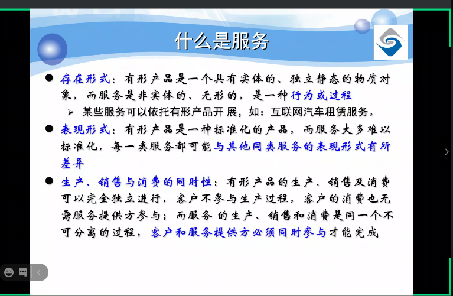
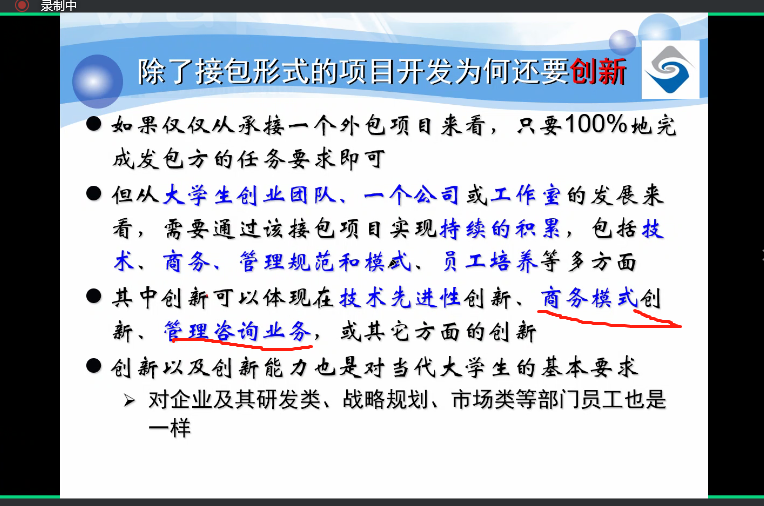
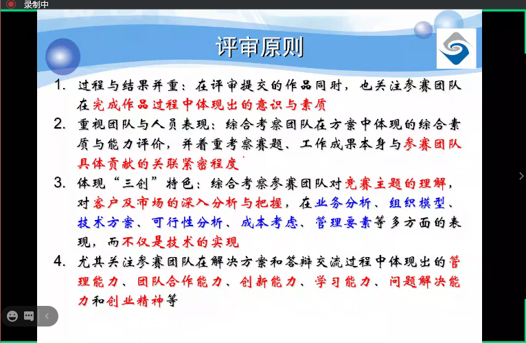
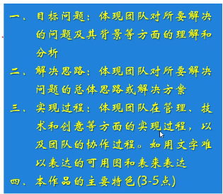
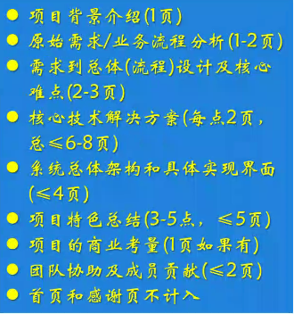
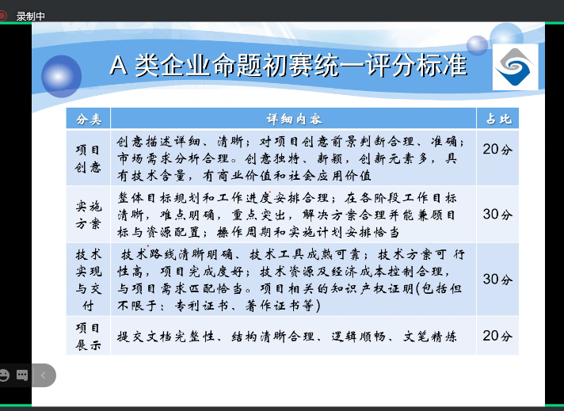
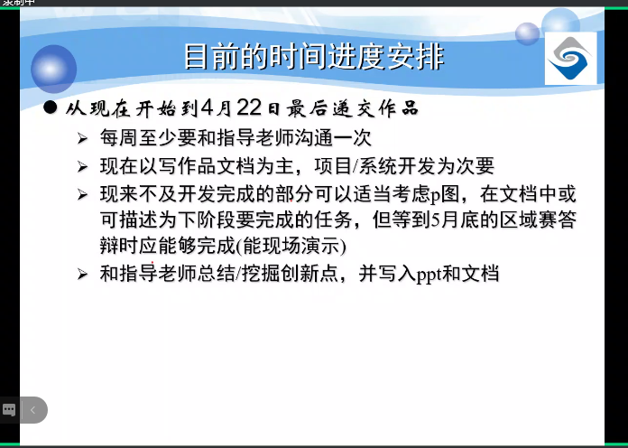
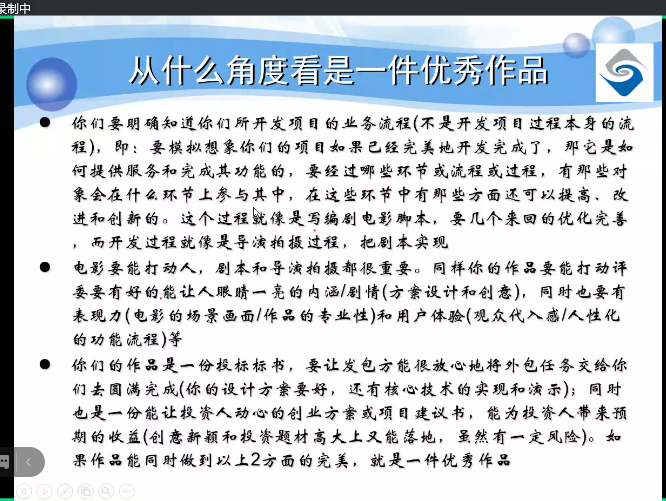

# 三大导向

要求**最终服务产业为目的**，根据实际产业需求提供**可操作的解决方案**

基于信息技术实现或深刻体现信息技术理念，用信息技术或互联网思维解决实际问题

强调与一切从现实问题出发

只从题目要求出发，获一等奖的几率较低，要有基于现有技术或前沿技术实现的创新

产品和商业逻辑要经得起推敲，开发流程要符合当前服务外包流程

A09智能计算，核心在于算法模型的创新

评审原则

1. 团队完成作品过程中体现出的意识与素质
2. 工作成果本身与团队具体贡献的关联紧密程度
3. 体现三创特色：考察团队对竞赛主题的理解，对客户及市场的深入分析与把握，业务分析、组织模型、技术方案、可行性分析、成本考虑、要素管理，不仅仅是技术的实现
4. s

过程-技术&创新-项目完备-团队

作品构成

1. 前言
2. 创意描述
3. 功能简介
4. 特色综述
5. 开发工具与技术
6. 应用对象
7. 应用环境
8. 结语

概要介绍

项目简介ppt

1. 目标与解决思路

2. 问题分析与解决方案

3. 技术路线及技术实现方案

4. 业务模式、人员组织框架及可行性分析

5. 其他

   不建议长段文字

项目详细方案

