# Shell

sudo cat /etc/shells 可以看见六种shell解析器

/bin/sh

/bin/bash

/bin/nologin

/bin/dash

/bin/tcsh

/bin/csh  

ubuntu系统默认的解析器是/bin/bash


## **Shell脚本入门**

​	#!/bin/bash开头（指定解析器）

​	echo “helloworld” **输出**

**VIM编辑** 

vim 文件名进入编辑	遇到读写问题可以直接加sudo

按 i 或 | 进入编辑模式，按esc退出编辑模式，进入命令行模式

**VIM保存**

命令行模式中输入：wq！，基本上万能，w表示write，q表示quit退出vim编辑器

多命令处理

**创建脚本，写入文件**

创建shell脚本touch xxx.sh

在shell脚本中编辑（解释器，内容，shell命令写入也是用 >> 形如 echo ”XXX“ >> xx.txt）

外部运行

## shell变量

​	set命令查看所有变量

**系统变量**

​	$HOME $PWD $SHELL $USER等

**自定义变量**

​	变量名 = 值    且**等号左右不能有空格**

​	unset删除变量

​	只读变量 加前缀readonly（不可unset删除）

​	环境变量建议**大写**

​	bash解释器中的变量默认为字符串，无法直接**数值运算**

​	带空格的字符串要用单/双引号括起来

**特殊变量$n**

​	n表示数字，类似C#输入多个变量的{1}{2}，$0表示文件名本身，后续是自命名的

**特殊变量$#**

​	获取所有输入参数的个数（因为0是文件名，所以输入参数个数是从1开始算的）

**特殊变量$*、$@**

​	$*表示命令行中所有参数，并且看作整体（自定义的）

​	$@表示命令行中所有参数，分开看待各个参数

**特殊变量$?**

​	$?表示最后一次执行的命令的返回状态，变量为0表示正确

## 运算符

**基本语法**

​	$((运算式)) 或$[运算式]

​	expr x op y（要加空格）

​	expr 运算也可以嵌套实现，用``包含

## 条件判断

**基本语法**

​	[ condition ] (条件两边要留空格)

​	**多条件判断**： &&表示前一条执行成功则执行后一条，|| 表示前一条执行失败则执行下一条

## 流程控制

**基本语法**

​	if [ 条件判断式 ]；then 程序 fi

​	if [ 条件判断式 ] 

​		then

​			程序

​	fi

​	if和[之间有空格

​	**case语句**

​	case $变量名 in

​		值1）

​			程序

​		；；

​		值2）

​			程序

​		；；

​	...

​	esac

​	**for语句**

​	for((；；))

​		do

​			程序

​		done

​	**while循环**

​	while [ 条件判断式 ]

​		do

​			程序

​		done

​	**read读取控制台输入**

​	read(选项)(参数)

​	选项：

​		-p：指定读取值时的提示符

​		-t：指定读取值时等待的时间

​		参数

​			变量：指定读取值的变量名

## 函数

​	**系统函数**

​	basename基本语法

​	basename[string/pathname] [suffix]

​	pathname是文件名，是basename截取的内容，如果后面还指定了suffix后缀，那么basename会讲后缀也去掉

​	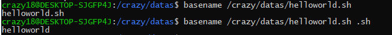

​	dirname基本语法

​		获取文件绝对路径

​		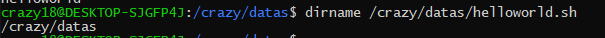

​	**自定义函数**

​	[ function ] funname[()]

​	{

​		Action；

​		[return int;]

​	}

​	funname

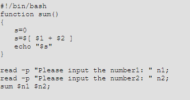

## Shell工具

### cut

​	剪切数据

​	基本用法：cut[选项参数]	filename

​	默认用tab分隔

​	选项参数 -f 列号，提取第几列 -d 分隔符，按照指定分隔符分割列

​	截取ip地址

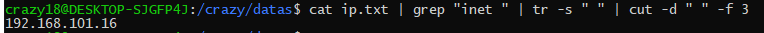

### sed

​	**基本用法**

​	sed[选项参数] ‘command’	filename

​	参数 -e 直接在指令列模式上进行sed动作编辑

​	command中有

​	a 新增

​	d 删除

​	s 查找并替换（/符号后加g表示global全局替换）

### awk

​	**基本用法**

​	awk[选项参数] ‘pattern{action1} pattern2{action2}...’	filename

​	pattern awk在数据中查找的内容，是匹配模式

​	选项参数

​	-F 指定输入文件折分隔符

​	-v 赋值一个用户定义变量

​	**内置变量**

​	FILENAME 文件名

​	NR 已读的记录数

​	NF 浏览记录的域的个数

### sort

sort(选项)(参数)

选项

-n 按照数值大小排序

-r 相反的顺序排序

-t 设置分隔符

-k 指定需要排序的列

# Hadoop

​	**优势**

​		高可靠性

​		高扩展性

​		高效性

​		高容错性

​	**组成**

​		MapReduce 计算

​		Yarn资源调度

​		HDFS数字存储

​		Common 辅助工具

​	**HDFS架构概述**

​		NameNode（nn）存储文件的元数据，文件目录

​		DataNode 本地文件系统存储文件块数据和快数据的校验和

​		Secondary NameNode 用来监控HDFS状态的辅助后台程序

​	**YARN架构概述**

​		ResourceManager用于处理客户端请求，监控NodeManager，启动或监控	ApplicationMaster，资源分配与调度

​		NodeManager用于管理节点上的资源，处理来自RM的命令。处理来自AM的命令
​		ApplicationMaster负责数据的切分，为应用程序申请资源并分配给内部的任务，任务的监控与容错

​		Container分装了某节点上的多维度资源如内存、cpu、磁盘、网络

​	**MapReduce架构概述**

​		将计算过程分为Map和Reduce

​		Map并行处理输入数据

​		Reduce对Map结果进行汇总

## 运行环境搭建

​	https://blog.csdn.net/yps_leaf/article/details/104467624/

## Hadoop目录

​	**bin**存放hadoop相关服务进行操作的脚本

​	**etc**存放hadoop的配置文件

​	**lib**存放hadoop本地库，可以进行压缩解压功能

​	**sbin**存放启动和停止hadoop相关服务的脚本

​	**share**存放依赖jar包、文档、官方案例

## hadoop运行模式

​	有本地模式、伪分布式、完全分布式模式

### 伪分布式

1. ​	启动HDFS运行MapReduce，测试集群增、删、查，运行wordcount测试

​	集群增删查：

​		启动集群后启动namenode和datanode

​		可以在web端查看hdfs文件系统（http://hadoop101:50070/dfshealth.html#tab-overview）

​		创建文件夹input 在hadoop文件目录下输入命令bin/hafs dfs -mkdir -p /user/ub1/input

​		上传文件命令 bin/hdfs dfs -put **wcinput/wc.input**

[^wcinput/wc.input是本地文件夹的文件]: 

 /user/ub1/input

​		运行wordcount程序测试bin/hadoop jar share/hadoop/mapreduce/hadoop-mapreduce-examples-2.7.5.jar wordcount    /user/ub1/input/    /user/ub1/output

​	

​	2.	启动yarn运行MapReduce，测试集群增删查，运行wordcount测试

​	配置完环境之后，启动了namenode和datanode的前提下启动ResourceManager和NodeManager(sbin/yarn0daemon.sh start resource/nodemanager)

​	执行MapReduce如1hdfs中的操作

​	查看结果bin/hdfs dfs -cat /user/ub1/output/*

 3. 配置历史服务器

    配置mapred-site.xml(位于etc)

    启动(sbin/mr0jobhistory-daemon.sh start historyserver)

 4. 配置日志的聚集

    **日志聚集**的概念：应用运行完成后，将程序运行日志信息上传到HDFS系统上，以便方便的查看到程序运行详情

    查看地址(hadoop101:19888/jobhistory)

​	为分布式应用提供协调服务	

# Zookeeper

​	为分布式应用提供协调服务

​	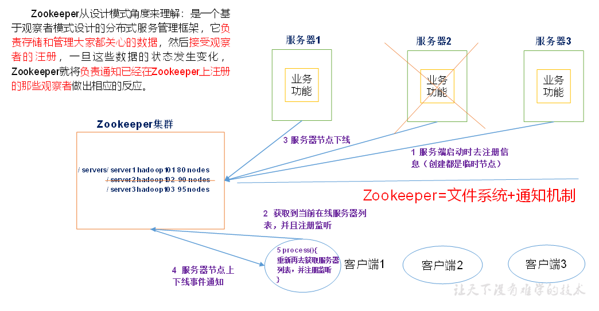

zookeeper存下大家都需要的数据，比如服务器的节点信息，在线状态，服务器发生变化及时通知客户端获取信息

## 特点

​	zookeeper是由一个leader，多个follower组成的

​	集群中有半数以上节点存活，zookeeper集群就能正常工作

​	全局数据一致，每个server保存一份相同的数据副本，Client无论连上哪个，数据都一致

​	更新请求按照顺序，来自同一个client的请求按照发送的顺序执行

## 数据结构

​	类似unix文件系统（/.../.../...），每个节点存1MB，每个节点可以通过路径唯一标识

## 应用场景

​	**统一命名服务**：对应用服务统一命名，便于识别，例如用域名代替IP

​	**统一配置管理**：一般要求一个集群中所有配置信息一致，修改后快速同步，可以将配置信息写入ZK中的Znode，每个客户端监听这个Znode，发生修改后及时通知

​	**统一集群管理**：实时掌握每个节点状态，监听Znode

​	**服务器动态上下线**：通知客户端服务器节点上下线

​	**软负载均衡**：记录每台服务器访问数，让访问数最少的服务器处理最新的访客

## 内部原理

​	**半数机制**：有一半以上机器存活集群可用，所以zookeeper可以安装奇数台服务器

​	工作时会选取一个leader节点，剩余的为follower，leader是通过内部选举机制临时产生的

## 安装部署

安装一个secureCRT软件用来连接三台服务器，方便操作

**本地安装**（就是一台服务器安装）

1. 下载解压zookeeper到随便一个目录下，我选了/usr/local/
2. 将conf目录下的zoo_sample.cfg改为zoo.cfg，并修改其中的dataDir=$pwd/zkData(自己创建的文件夹)
3. bin/zkServer.sh start启动服务器 jps查看是否启动
4. bin/zkServer.sh status查看状态
5. bin/zkCli.sh 启动客户端
6. quit退出客户端
7. bin/zkServer.sh stop停止zookeeper

**分布式安装**（三台服务器一起配置集群）

1. 参照本地安装在三台服务器上配置好基础内容并测试

2. 配置服务器编号，在本地安装时创建的zkData下创建文件myid，分别编号2、3、4

3. 配置zoo.cfg，添加集群信息如下

4. server.2=hadoop102:2888:3888

   server.3=hadoop103:2888:3888

   server.4=hadoop104:2888:3888

   其中本地ip使用0.0.0.0，比如在hadoop102配置时，server.2使用的就是server.2=0.0.0.0:2888:3888

5. 分别启动三台机器的zk，查看状态，可以看见leader机型和follow机型


## 编程应用

1. 创建maven工程，添加pom依赖文件

   ```
   <dependencies>
   		<dependency>
   			<groupId>junit</groupId>
   			<artifactId>junit</artifactId>
   			<version>RELEASE</version>
   		</dependency>
   		<dependency>
   			<groupId>org.apache.logging.log4j</groupId>
   			<artifactId>log4j-core</artifactId>
   			<version>2.8.2</version>
   		</dependency>
   		<!-- https://mvnrepository.com/artifact/org.apache.zookeeper/zookeeper -->
   		<dependency>
   			<groupId>org.apache.zookeeper</groupId>
   			<artifactId>zookeeper</artifactId>
   			<version>3.4.10</version>
   		</dependency>
   </dependencies>
   
   ```

2. 拷贝log4j.properties到resource目录下

   ```
   log4j.rootLogger=INFO, stdout  
   log4j.appender.stdout=org.apache.log4j.ConsoleAppender  
   log4j.appender.stdout.layout=org.apache.log4j.PatternLayout  
   log4j.appender.stdout.layout.ConversionPattern=%d %p [%c] - %m%n  
   log4j.appender.logfile=org.apache.log4j.FileAppender  
   log4j.appender.logfile.File=target/spring.log  
   log4j.appender.logfile.layout=org.apache.log4j.PatternLayout  
   log4j.appender.logfile.layout.ConversionPattern=%d %p [%c] - %m%n  
   ```

3. 创建客户端，新建**zktest**java测试类，内容如下

   ```
   private static String connectString =
    "hadoop102:2181,hadoop103:2181,hadoop104:2181";
   	private static int sessionTimeout = 2000;
   	private ZooKeeper zkClient = null;
   
   	@Before
   	public void init() throws Exception {
   
   	zkClient = new ZooKeeper(connectString, sessionTimeout, new Watcher() {
   
   			@Override
   			public void process(WatchedEvent event) {
   
   				// 收到事件通知后的回调函数（用户的业务逻辑）
   				System.out.println(event.getType() + "--" + event.getPath());
   
   				// 再次启动监听
   				try {
   					zkClient.getChildren("/", true);
   				} catch (Exception e) {
   					e.printStackTrace();
   				}
   			}
   		});
   	}
   
   ```

4. 创建客户端和服务器自行测试

# Hbase

## HBase数据模型

​	数据存储在一张表中，有行列，HBase的底层物理存储结构是K-V模式，更像一个多维Map

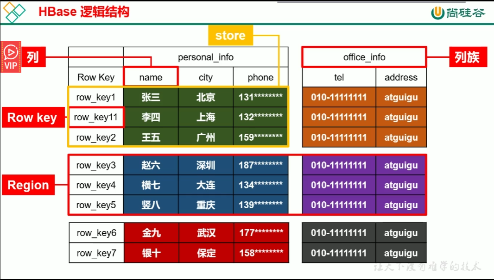

Row Key按照字典序排列


**Store**存储数据块的部分

纵向切分出的是不同的列族，横向切分出的是表的切片内容

### **物理存储结构**

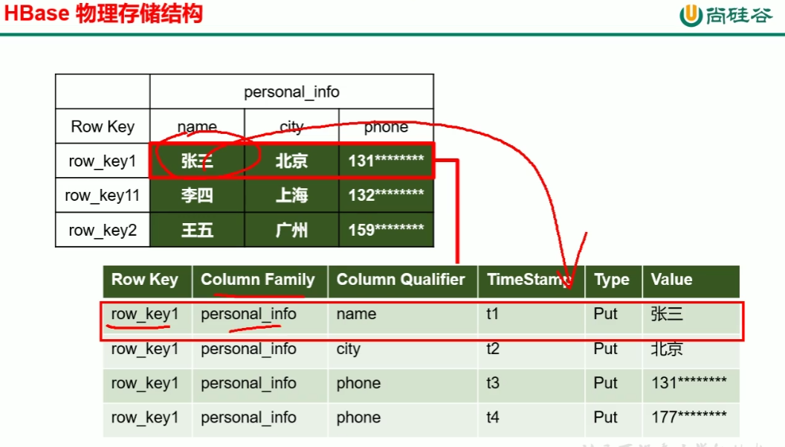

注意：TimeStamp时间戳部分，windows和linux时间不同步会导致数据操作出现问题

正常状态的数据标记为put，而面对时间戳更大的Delete类型，则该行早于delete状态时间的数据都不返回数据

### **数据模型**

**Name Space**

​	命名空间，类似普通数据库database概念，每个命名空间下有多个表，Hbase下有两个自带的命名空间hbase和default，hbase存放HBase内置的表，default表是用户默认使用的命名空间

**Region**横向切片  

​	类似普通数据库表的概念，但是HBase定义表时只需要声明列族，不需要声明列，说明字段可以动态、按需指定。

**Row**
	每行数据又一个RowKey和多个Column列组成，数据按照RowKey字典序存储，并且查询数据时只能根据RowKey进行检索

**Column**

​	HBase中的每个列都是列族（column family）和列限定符（column qualifier）进行限定，建表时只需要实现定义列族

**Time Stamp**

​	用来标识数据的不同版本（version），数据写入的时候如果不指定时间戳，会自动为其加上该字段，自动填充当前时间

**Cell**

​	由{rowkey，column family：column qualifier ,timestamp}唯一确定的一个单元，cell中的数据是没有类型的，由字节码形式存贮

### HBase基本架构

**RegionServer作用**

Data:get,put(add&&modify）,delete

Region：splitRegion（切分表），compactRegion（合并表）

**Master Zookeeper**

zookeeper帮助Master管理

Master管理表结构ddl，zookeeper管理dml

**Table**：create,delete,alter

**RegionServer**:分配到regions到每个RegionServer，监控每个RS的状态，底层对数据的增删改查，master是管理高层级的增删改查（表）

多个master，源数据由中间件保存

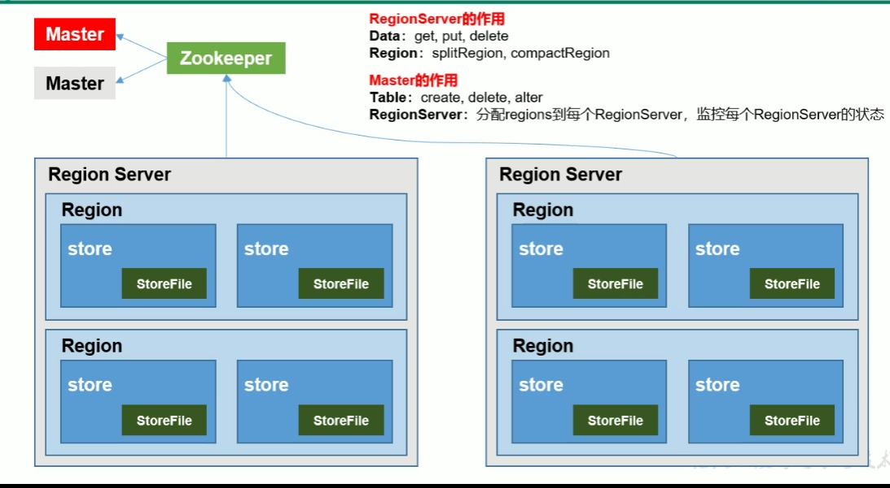


## HBase部署安装 （伪分布式）

学习阶段是在win10下的linux子系统安装

准备环境：java，hadoop

第一步，hbase安装包下载（http://hbase.apache.org/）

目前只成功了单台伪分布式虚拟机，暂时不写安装部署

错误来源，host文件配置问题，应该废除127.0.0.1，改用静态地址

## HBase的Shell操作

1. 进入HBase客户端命令行**hbase shell**（bin目录下）

2. list查看数据库中的表

3.  create ’xxx‘，’xxx‘创建表，第一个是表名，后面是列族

4. 插入put ’表名‘，’Rowkey值‘，’列族：列名‘，’值‘

5. 查看数据 scan ’表名‘，[{查询条件，比如STARTROW=>’值‘ ，STOP => '值'}]

   或get ‘表名’,‘列族：列名’

   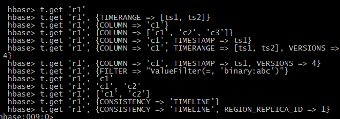

6. 查看表结构 describe ‘表名’

7. 更新字段 用put

8. 统计数据行数用 count

9. 删除 deleteall ‘表名’，‘值’ delete ‘表名’，‘值’，‘列族：列名”，删除之后，之前所有覆盖的数据都不再显示

10. 清空 truncate ’表名‘

11. 删除表 首先disable ’表名‘ 然后drop

12. 表信息变更 alter ’表名‘，{NAME=>'列族'，VERSIONS=>值}

## HBASE详细架构

hbase依赖zookeeper、hdfs，需要事先启动

HMaster管理HRegionServer

HRegionServer有HLog、**HRegion**（一个server可以维护多个）

HRegion中含有多个**Store**（列族）

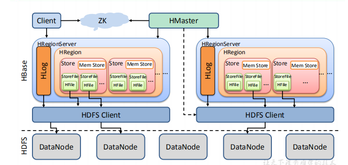

### HBASE写流程

put 

客户端

1、向zk请求meta表所在的RegionServer，zk返回meta的Regionserver地址

2、向regionserver请求meta，返回meta，通过读namespace：table/rowkey，获取RS

3、连接到server上，创建缓存memcache，发送put请求到对应server

4、写入server


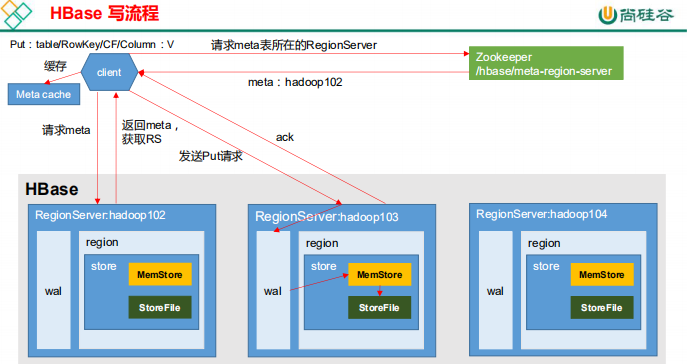

### MemStore Flush

memstore达到刷写时机的时候，所在region的所有memstore都会刷写，同时，memgstore大小达到默认大小时，会阻止继续往memstore中写入数据，

当rs中memstore的总大小达到一定值，region会按照所有memstore大小顺序刷写，直到总大小低于该值，同时也会阻止往memstore中数据的写入

达到自动刷写时间会触发memstore flush

wal文件数量超过一定值后，region按照时间顺序依次刷写直到wal中文件数量少于该值

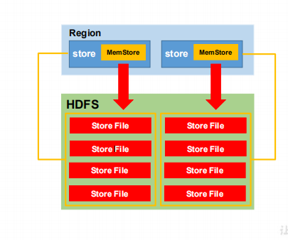

### HBASE读流程

1. client访问zk，得到meta表所在哪个regionserver
2. 访问该rs，得到meta表，再根据读请求的表信息，查询出目标数据处在该rs中的哪个region中，将table的region信息和meta表位置信息缓存到客户端的meta cache
3. 与目标rs通信
4. 在block cache（读缓存）、memstore和storeFile中查询目标数据，将得到的数据合并
5. 将从文件中查询到的block数据块缓存到block cache
6. 合并完成的结果返回给客户端

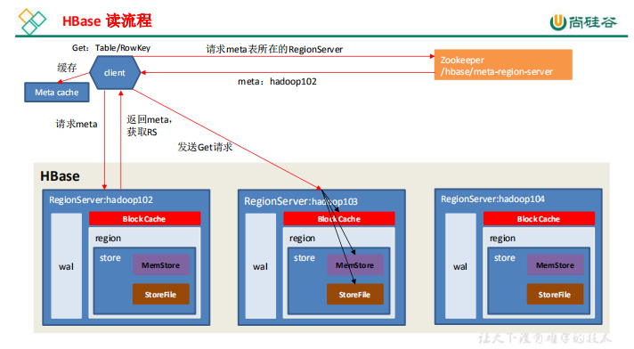

### StoreFile Compaction和split

compaction是为了减少hfile的数量，及时清理掉过期和删除的数据(合并时间戳)，主要有minor compaction和major compaction，前者只会合成临近的若干hfile，后者会将store下的所有hfile合成为一个hfile，并清理掉过期和删除的数据

split是在时机合适的时候，将region拆分，例如store中的所有StoreFile总大小超过某一值(老版本)，或一个store下所有storefile的总大小超过Min(R^2 * 
"hbase.hregion.memstore.flush.size",hbase.hregion.max.filesize")中的最小值（新版本）

## HBase API

首先是关于Hbase Api的基本操作问题，增删改查，核心是dml 和 ddl操作，这其中又是dml为主体

具体内容参考仓库内Hbase_demo1项目中的TestAPI

具体步骤为

1. 与数据库建立连接，这一步事先写入，在运行java程序时就首先完成
2. 对数据库的各类操作
   1. 判断表是否存在（直接调用管理员对象自带的方法tableExists即可）
   2. 创建表
      1. 判断是否存在列族信息
      2. 判断要创建的表是否存在
      3. 创建表描述器（HTableDescriptor）
      4. 创建列族描述器（HColumnDescriptor）添加需要的列族信息
      5. 调用admin的方法createTable创建
   3. 删除表
      1. 判断表是否存在
      2. 首先disable表
      3. 调用admin的deleteTable方法删除表
   4. 创建命名空间
      1. 创建命名空间描述器
      2. 创建命名空间
   5. 向表中插入数据
      1. 获取表对象
      2. 创建put对象（对put对象添加各种属性）
      3. 插入数据
      4. 关闭连接
   6. 获取数据（get）
      1. 获取表对象
      2. 创建get对象（对get对象添加各种数据，如列族，列名）
      3. 获取数据result
      4. 解析result获得Cell
      5. 关闭连接
   7. 获取数据（scan）
      1. 获取表对象
      2. 构建Scan对象
      3. resultscanner扫描表
      4. 解析resultscanner
      5. 关闭连接
   8. 删除数据
      1. 获取表对象
      2. 获取delete对象
      3. 设置delete的列、列族（推荐使用addColumns，删除所有时间戳版本信息）
      4. 删除对象
      5. 关闭连接

### MapReduce

**首**先是系统自带的mr

1. 创建一个表（例：fruit）

2. 创建tsv文件上传到hdfs中（例：将fruit.tsv文件上传到hdfs / 目录下，命令（yarn jar /hbase/lib/hbase-server-版本号.jar importtsv -Dimporttsv.column=HBASE_ROW_KEY,info:name,info:color fruit hdfs://hadoop101:9000/ ））

   解析来看就是yarn  jar  hbase-server.jar  import**tsv**  -Dimporttsv.column=HBASE_ROW_KEY,列族：列名，列族：列名 ...   表名  hdfs位置

3. 查看导入是否成功，hbase shell中查看

**自**定义的mr（将hdfs文件系统中的文件数据写入到fruit1表中）

分步实现

1. 首先是构建FruitMapper类用于读取fruit.tsv中的数据（context.write(k,v)）
2. 构建FruitReducer类将读取到的文件中的数据经过筛选后写入fruit1表中
3. 构建FruitDriver类题组装job（1.创建job对象|2.设置驱动类路径|3.设置Mapper输出类型|4.设置Reducer类|5.设置输入输出参数|6.提交任务）
4. Driver中的main运行任务

自定义的mr2（将fruit表中的数据迁移到表fruit2中）

同样是构造一样的三个类，详情查看github back_end库中Hbase_demo代码

# Hive

## Hive基本概念

​	由Facebook开源的用于解决海量结构化日志的数据统计，基于一个数据仓库工具，将结构化的数据文件映射为一张表，提供类SQL的查询功能，本质是将HQL转化为MapReduce函数

 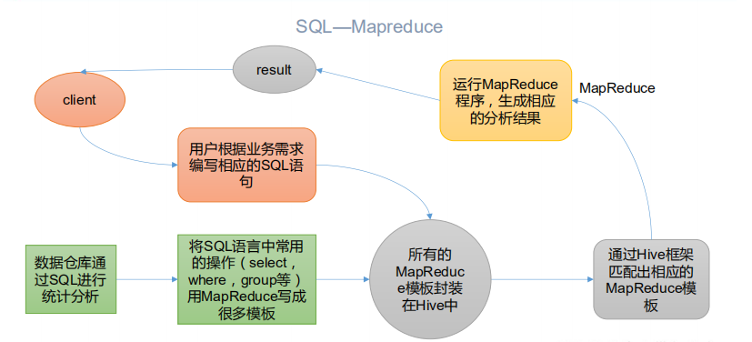

1. hive处理的数据存储在hdfs
2. hive分析数据底层的实现是mapreduce
3. 执行程序运行在yarn上

**优点**

1. 直接采用类sql语句
2. 避免了去写mr语句
3. 执行延迟搞，用于数据分析，对实时性要求不高
4. 对于处理大数据有优势
5. 支持用户自定义函数

**缺点**

1. 迭代式算法无法表达
2. 数据挖掘方面不擅长，mr数据处理流程的限制，效率高的算法无法实现
3. 效率低，调优比较难实现，粒度粗

### 架构原理

​	用户接口Client

​		CLI（command-line interface）,JDBC/ODBC(jdbc访问hive)，WEBUI(浏览器访问hive)

​	元数据：Metastore

​		包括表名、表属数据库、表的拥有者、列/分区字段、表的类型、表的数据所在目录

​		推荐使用mysql存储Metastore

​	hadoop

​		使用hdfs存储，mr计算

​	驱动器：Driver

​		解析器、编译器、优化器、执行器

流程就是：hive提供一系列交互接口，接收用户指令，使用驱动器结合元数据，将指令翻译为MR，提交到Hadoop中执行，将结果返回到用户交互接口

### 与数据库比较

​	可以将hive理解为数据库，因为使用了类sql查询语言hql，

