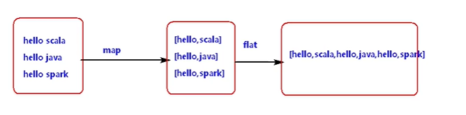

### 字符串

比较:equals

比较忽略大小写:equalsIgnoreCase

indexOf：如果字符串中有传入的assci码对应的值，返回下标

```
object String {  
def main(args: Array[String]): Unit = {    
val s="fdgedfe"    
val s1="fdgedfe"    
println(s.equals(s1)) //返回false    println(s.equalsIgnoreCase(s1))  //返回true*   println(s.indexOf(101)) //101对应的是字母e,而e对应的索引为3,返回3 
} }
```

#### 方法：

char charAt(int index)
返回指定位置的字符，从0开始

int compareTo(Object o)
比较字符串与对象

int compareTo(String anotherString)
按字典顺序比较两个字符串

int compareToIgnoreCase(String str)
按字典顺序比较两个字符串，不考虑大小写

String concat(String str)
将指定字符串连接到此字符串的结尾

boolean contentEquals(StringBuffer sb)
将此字符串与指定的 StringBuffer 比较

static String copyValueOf(char[] data)
返回指定数组中表示该字符序列的 String

static String copyValueOf(char[] data, int offset, int count)
返回指定数组中表示该字符序列的 String

boolean endsWith(String suffix)
测试此字符串是否以指定的后缀结束

boolean equals(Object anObject)
将此字符串与指定的对象比较

boolean equalsIgnoreCase(String anotherString)
将此 String 与另一个 String 比较，不考虑大小写

byte getBytes()
使用平台的默认字符集将此 String 编码为 byte 序列，并将结果存储到一个新的 byte 数组中

byte[] getBytes(String charsetName）
使用指定的字符集将此 String 编码为 byte 序列，并将结果存储到一个新的 byte 数组中

void getChars(int srcBegin, int srcEnd, char[] dst, int dstBegin)
将字符从此字符串复制到目标字符数组

int hashCode()
返回此字符串的哈希码

int indexOf(int ch)
返回指定字符在此字符串中第一次出现处的索引（输入的是ascii码值）

int indexOf(int ch, int fromIndex)
返返回在此字符串中第一次出现指定字符处的索引，从指定的索引开始搜索

int indexOf(String str)
返回指定子字符串在此字符串中第一次出现处的索引

int indexOf(String str, int fromIndex)
返回指定子字符串在此字符串中第一次出现处的索引，从指定的索引开始

String intern()
返回字符串对象的规范化表示形式

int lastIndexOf(int ch)
返回指定字符在此字符串中最后一次出现处的索引

int lastIndexOf(int ch, int fromIndex)
返回指定字符在此字符串中最后一次出现处的索引，从指定的索引处开始进行反向搜索

int lastIndexOf(String str)
返回指定子字符串在此字符串中最右边出现处的索引

int lastIndexOf(String str, int fromIndex)
返回指定子字符串在此字符串中最后一次出现处的索引，从指定的索引开始反向搜索

int length()
返回此字符串的长度

boolean matches(String regex)
告知此字符串是否匹配给定的正则表达式

boolean regionMatches(boolean ignoreCase, int toffset, String other, int ooffset, int len)
测试两个字符串区域是否相等

boolean regionMatches(int toffset, String other, int ooffset, int len)
测试两个字符串区域是否相等

String replace(char oldChar, char newChar)
返回一个新的字符串，它是通过用 newChar 替换此字符串中出现的所有 oldChar 得到的

String replaceAll(String regex, String replacement
使用给定的 replacement 替换此字符串所有匹配给定的正则表达式的子字符串

String replaceFirst(String regex, String replacement)
使用给定的 replacement 替换此字符串匹配给定的正则表达式的第一个子字符串

String[] split(String regex)
根据给定正则表达式的匹配拆分此字符串

String[] split(String regex, int limit)
根据匹配给定的正则表达式来拆分此字符串

boolean startsWith(String prefix)
测试此字符串是否以指定的前缀开始

boolean startsWith(String prefix, int toffset)
测试此字符串从指定索引开始的子字符串是否以指定前缀开始

CharSequence subSequence(int beginIndex, int endIndex)
返回一个新的字符序列，它是此序列的一个子序列

String substring(int beginIndex)
返回一个新的字符串，它是此字符串的一个子字符串

String substring(int beginIndex, int endIndex)
返回一个新字符串，它是此字符串的一个子字符串

char[] toCharArray()
将此字符串转换为一个新的字符数组	

String toLowerCase()
使用默认语言环境的规则将此 String 中的所有字符都转换为小写

String toLowerCase(Locale locale)
使用给定 Locale 的规则将此 String 中的所有字符都转换为小写	

String toString()
返回此对象本身（它已经是一个字符串！）

String toUpperCase()
使用默认语言环境的规则将此 String 中的所有字符都转换为大写	

String toUpperCase(Locale locale)
使用给定 Locale 的规则将此 String 中的所有字符都转换为大写

String trim()
删除指定字符串的首尾空白符	
static String valueOf(primitive data type x)
返回指定类型参数的字符串表示形式

### Array

#### 1、一维数组

声明：

```
val arr = Array[String]("hello","world")
或
val arr1 = new Array[Int](5)
```

遍历：

```
for (ele<-arr){
	println(ele)
}
或
arr1.foreach(println)
```

#### 2、二维数组

创建：

```
val array = new Array[Array[Int]](3)
```

赋值：

    arr2(0) = Array[Int](1,2,3)
    arr2(1) = Array[Int](4,5,6)
    arr2(2) = Array[Int](7,8,9)
遍历：

    for (arr <- array) {
      for (ele <- arr) {
        println(ele)
      }
    }
    或
    for(arr<-array;elem<-arr){
      println(ele)
    }
    或
    array.foreach(arr=>{arr.foreach(println)})
#### 3、可变长度数组

```
import scala.collection.mutable.ArrayBuffer //导入包
val arr = ArrayBuffer[Int](elems = 1,2,3)
arr.+=(4) //添加到末尾 1 2 3 4
arr.+=:(100) //添加到头部 100 1 2 3 4
arr.append(7,8,9) //添加到末尾 100 1 2 3 4 7 8 9
```

### List

列表具有递归的结构（也就是链接表结构）而数组不是

    val list = List("hello","123")
    val res =list.+("aaa")
    print(res)
    
    输出：
    List(hello,123)aaa
1、map

```
val nameList = List(
	"hello 123",
	"hello 456",
	"hello 789"
)
val mapResult:List[Array[String]] = nameList.map{
	x => x.split(" ") 
}
mapResult.foreach(arr=>{
	println("新的数组")
	arr.foreach(println)
})

输出：
新的数组
hello
123
新的数组
hello
456
新的数组
hello
789
```

2、flatmap

```
val nameList = List(
	"hello 123",
	"hello 456",
	"hello 789"
)
val result:List[Array[String]] = nameList.flatMap{
	x => x.split(" ") 
}
result.foreach(println)

输出：
hello
123
hello
456
hello
789
```

3、filter过滤函数

匹配上的留下

    val nameList = List(
      "hello 123",
      "hello 456",
      "hello 789"
    )
    val strings:List[String] = nameList.filter(s=>{
      "hello 123".equals(s)
    })
    strings.foreach(println)
    
    输出：
    hello 123
4、count函数

```
val list = List(1,2,3,4,5)
val value = list.count { x => x>3 }
println(value)

输出：
2
```

5、可变List

    import scala.collection.mutable.ListBuffer
    val list = ListBuffer[Int](1,2,3)
    list.append(4,5,6)
    list.foreach(println)
### Set

Set 当中元素是无序的，而且会去重

1、intersect ：取交集

    val set =Set[Int](1,2,3,4)
    val set1 = Set[Int](3,4,5,6)
    val res :Set[Int]= set.intersect(set1)
    输出：
    3 4
2、diff ：取差集

```
val res1 :Set[Int]=set.diff(set1)
输出：
1 2 3
```

3、操作符操作：&：取交集    ~&：取差集

4、filter过滤器

5、可变长的Set

在使用Set时，要使用可变或不可变时，只需在Set前加上mutable或imutable

```
import scala.collection.mutable
import scala.collection.imutable
```

+()：为集合添加新元素，x并创建一个新的集合，除非元素已存在

+=()：新元素直接加在原Set后

### Map

1、map默认是不可变的，当出现同一个key值的时候，后面的值会将前面的值进行覆盖

```
val map =Map[String,Int]("a"->100,"b"->200,("c",300),("c",400))
输出：
(a,100) (b,200) (c,400)
```

2、根据key返回value值。使用一个get，如果存在对应的值就会返回一个Some类型的值，反之则是一个None，这两个类型都是Option的子类。最后再.get会返回对应的基本类型。

```
map.get("a")
map.get("aa")
map.get("a").get
输出：
Some(100)
None
100
```

3、当对一个不存在的key获取他的value时，会报错，这时可以使用 .getOrElse()方法，表示当不存在的时候，返回这个方法里面的东西。

4、获取所有的key，使用.keys方法，返回值的类型是Iterable [String]，根据所获取的key值打印出所对应的value值

    map.keys.foreach(key => {
      println(map.get(key))
    })
    输出：
    Some(100)
    Some(200)
    Some(400)
4、合并两个map

map1.++(map2)：将map2合并在map1中

map1.++=(map2)：将map1合并在map2中

5、可变长的Map（使用put添加元素）

    import scala.collection.mutable.Map
    val map = Map[String,Int]()
    map.put("a",4)
6、filter

    map.filter(tp => {
      val key = tp._1
      val value = tp._2 
      value == 4
    })
    输出：
    (a,4)
### Tuple

与列表一样，与列表不同的是元组可以包含不同类型的元素。元组的值是通过将单个值包含在圆括号中构成的。

最多有22个元素，可以使用._数字获取元组当中所对应的值

元组可以new，也可以不new，也可以直接在（）中写元素

    val tuple1 = new Tuple1(1);
    val tuple2 = new Tuple2("a", 1);
    val tuple3 = new Tuple3("a", true, 1);
1、遍历

不能直接使用for或foreach，应使用iterator

```
val res = tuple3.productIterator
while(res.hasNext){
  println(res.next())}
或
res.foreach(println)
```

2、toString()方法：将元组当中的值放在一个括号里面进行返回

```
println(tuple3.toString())
输出：
(a,true,1)
```

3、swap函数，只适用于有两个元素的元组

```
print(tuple2.swap)
输出：
(1,a)
```

### Trait

Scala Trait相当于 Java 的接口，实际上它比接口还功能强大。与接口不同的是，它还可以定义属性和方法的实现。trait不可以传参。

1、一个类继承多个trait时，第一个关键字使用extends，后面的均使用with

```
trait read{
  def read(name:String): Unit ={
    println(name +" read")
  }
}
trait listen{
  def listen(name:String): Unit ={
    println(name +" listen")
  }
}
class Person() extends read with listen{
}
```

2、trait中可以有方法体的实现或者方法体的不实现，类继承了trait要实现trait中没有实现的方法

### 模式匹配 Match

1、case_ ：默认匹配，什么都匹配不上时才匹配，放在最后

2、match可以匹配值也可以匹配类型

3、匹配过程中会有数值的转换

4、从上往下匹配，匹配上之后会自动终止

5、模式匹配外部的"{...}"可以省略

```
val t = (1, 5.5, "a", true)
val res: Iterator[Any] = t.productIterator
res.foreach(MathTest)
def MatchTest(o: Any): Unit = {
  o match {
	 case 1 => println("value is 1")
     case i: double => println("type is double , value is :" + i)
     case s: String => println("type is String , value is :" + s)
     case _ => { 
       println("no match")
     }
  }
输出：
value is 1
type is double , value is :5.5
type is String , value is :a
no match
```

6、偏函数

如果一个方法中没有 match 只有case，这个函数可以定义成 PartialFunction 偏函数。偏函数定义时，不能使用括号传参，默认定义 PartialFunction 中传入一个值，匹配上了对应的case，返回一个值。

偏函数只能匹配一个值，匹配上了返回某个值

PartialFunction[A,B] A是匹配的类型，B是匹配上返回的类型

```
def MyTest: PartialFunction[String, Int] = {
  case "abc" => 2
  case "a" => 1
  case _ => 100
}
def main(args: Array[String]): Unit = {
  val res: Int = MyTest("abc")
  println(res)
}
输出：
2
```

### 样例类

使用了case关键字的类定义就是样例类(case classes)，样例类是种特殊的类。实现了类构造参数的getter方法（构造参数默认被声明为val），当构造参数是声明为var类型的，它将帮你实现setter和getter方法。

1、样例类默认帮你实现了toString,equals，copy和hashCode等方法

2、样例类可以new, 也可以不用new

```
case class Person(name:String,age:Int){

}
object CaseClass {
  def main(args: Array[String]): Unit = { 
    val p1 = new Person(name = "zhangsan",age = 18)
    val p2 = new Person(name = "zhangsan",age = 18)
    println(p1.equals(p2))
    println(p1)
  }
}
输出：
true
Person(zhangsan,18)
```

### 隐式转换

隐式转换是在Scala编译器进行类型匹配时，如果找不到合适的类型，那么隐式转换会让编译器在作用范围内自动推导出来合适的类型。

1、隐式值与隐式参数

隐式值是指在定义参数时前面加上implicit。隐式参数是指在定义方法时，方法中的部分参数是由implicit修饰（必须使用柯里化的方式，将隐式参数写在后面的括号中）。

隐式转换作用：当调用方法时，不必手动传入方法中的隐式参数，Scala会自动在作用域范围内寻找隐式值自动传入。

（1）同类型的参数的隐式值只能在作用域内出现一次，同一个作用域内不能定义多个类型一样的隐式值。

（2）implicit 关键字必须放在隐式参数定义的开头

（3）一个方法只有一个参数是隐式转换参数时，那么可以直接定义implicit关键字修饰的参数，调用时直接创建类型不传入参数即可。

（4）一个方法如果有多个参数，要实现部分参数的隐式转换,必须使用柯里化这种方式,隐式关键字出现在后面，只能出现一次

```
def sayName(implicit name: String): Unit = {
  println(name + " is a student ....")
}
def information(age: Int)(implicit name: String): Unit = {
  println("name is " + name + ", age is " + age)
}
def main(args: Array[String]): Unit = {
  implicit val name: String = "zhangsan"
  sayName
  information(20)
}
输出：
zhangsan is a student ....
name is zhangsan, age is 20
```

2、隐式转换函数
隐式转换函数是使用关键字implicit修饰的方法。当Scala运行时，假设如果A类型变量调用了method()这个方法，发现A类型的变量没有method()方法，而B类型有此method()方法，会在作用域中寻找有没有隐式转换函数将A类型转换成B类型，如果有隐式转换函数，那么A类型就可以调用method()这个方法。
隐式转换函数注意：隐式转换函数只与函数的参数类型和返回类型有关，与函数名称无关，所以作用域内不能有相同的参数类型和返回类型的不同名称隐式转换函数。

```
class Animal(name: String) {
  def canfly(): Unit = {
    println(name + " can fly")
  }
}
class Rabbit(xname: String) {
  val name = xname;
}
//在object当中定义。
implicit def RabbitToAnima(r: Rabbit): Animal = {
  new Animal(r.name);
}
//在main函数当中定义一个类的变量进行访问方法。
val r = new Rabbit("rabbit");
r.canfly()
输出：
rabbit can fly
```

3、隐式类

使用implicit关键字修饰的类就是隐式类。若一个变量A没有某些方法或者某些变量时，而这个变量A可以调用某些方法或者某些变量时，可以定义一个隐式类，隐式类中定义这些方法或者变量，隐式类中传入A即可。
隐式类注意：

（1）隐式类必须定义在类，包对象，伴生对象中。

（2）隐式类的构造必须只有一个参数，同一个类，包对象，伴生对象中不能出现同类型构造的隐式类。

```
class Rabbit1(xname: String) {
  val name = xname;
} 
 //在object当中定义隐式类。
implicit class Animal1(r: Rabbit) {
  def ShowName(): Unit = {
    println(r.name + " is Rabbit")   
  }
}
 //在mian方法中调用
val r = new Rabbit1("rabbit")
r.ShowName()
输出：
rabbit is Rabbit
```

