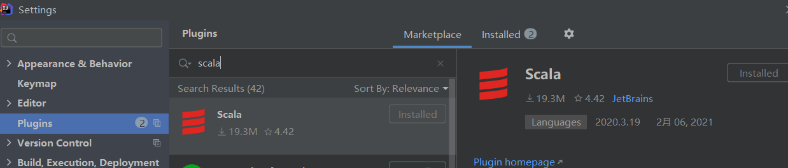
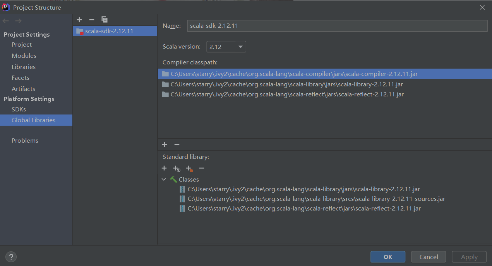
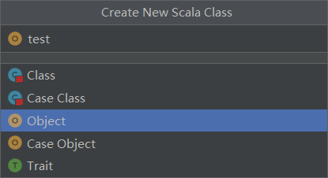
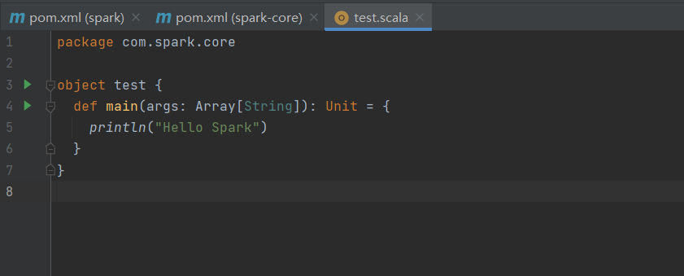
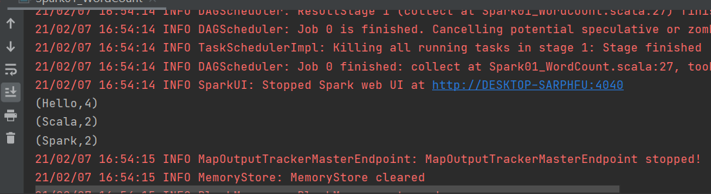

# Spark

主要用于数据计算，基于内存计算

#### spark内置模块


Spark Core 中提供了 Spark 最基础与最核心的功能，Spark 其他的功能都是在 Spark Core 的基础上进行扩展的。

Spark SQL 是 Spark 用来操作结构化数据的组件，可以使用 SQL或者 Apache Hive 版本的 SQL 方言（HQL）来查询数据。

Spark Streaming 是 Spark 平台上针对实时数据进行流式计算的组件，提供了丰富的处理数据流的 API。 

Spark MLlib 是 Spark 提供的一个机器学习算法库，提供了模型评估、数据导入和一些更底层的机器学习原语。

Spark GraphX 是 Spark 面向图计算提供的框架与算法库。

#### 搭建环境

1、创建一个Maven项目spark

（1）删除项目spark的src

（2）右键spark->New->Module  spark-core

2、下载scala

File->Settings->Plugins



添加sdk

File->Project Structure->Global Libraries



3、测试环境

spark-core->src->main->java





可以输出 Hello Spark证明搭建成功

# WorldCount例子

统计单词数量的思路图


#### 具体实现

步骤：建立和Spark框架的连接->执行业务操作->关闭连接

1、在spark-core的pom.xml中添加依赖

```
<dependencies>
    <dependency>
        <groupId>org.apache.spark</groupId>
        <artifactId>spark-core_2.12</artifactId>
        <version>3.0.0</version>
    </dependency>
</dependencies>
```

2、新建package data存储数据

1.txt 2.txt 

3、具体代码

```
package com.spark.core.wc
import org.apache.spark.rdd.RDD
import org.apache.spark.{SparkConf, SparkContext}
object Spark03_WordCount {
  def main(args: Array[String]): Unit = {
    // TODO 建立和Spark框架的连接
    // setMaster：设置环境 local：本地环境
    val sparConf = new SparkConf().setMaster("local").setAppName("WordCount")
    val sc = new SparkContext(sparConf)
    // TODO 执行业务操作
    // 1.读取文件数据
    val lines: RDD[String] = sc.textFile("data/*")
    // 2.拆分为单词(扁平化操作)
    val words: RDD[String] = lines.flatMap(_.split(" "))
    // 3.转换数据结构
    val wordToOne = words.map(
      word=>(word,1)
    )
    // 4. 按照相同单词分组聚合
    // Spark框架可将分组和聚合使用一个方法实现
    // reduceByKey:相同的key数据，可以对value进行reduce聚合
    val wordToCount = wordToOne.reduceByKey(_ + _)
    // 5.打印结果
    val array:Array[(String,Int)] = wordToCount.collect()
    array.foreach(println)
    // TODO 关闭连接
    sc.stop()
  }
}
```

输出结果：



#### 处理日志信息

在resource目录中创建 log4j.properties 文件，使其只显示error信息和结果

```
log4j.rootCategory=ERROR, console
log4j.appender.console=org.apache.log4j.ConsoleAppender
log4j.appender.console.target=System.err
log4j.appender.console.layout=org.apache.log4j.PatternLayout
log4j.appender.console.layout.ConversionPattern=%d{yy/MM/dd HH:mm:ss} %p %c{1}: %m%n
# Set the default spark-shell log level to ERROR. When running the spark-shell,the
# log level for this class is used to overwrite the root logger's log level, sothat
# the user can have different defaults for the shell and regular Spark apps.
log4j.logger.org.apache.spark.repl.Main=ERROR
# Settings to quiet third party logs that are too verbose
log4j.logger.org.spark_project.jetty=ERROR
log4j.logger.org.spark_project.jetty.util.component.AbstractLifeCycle=ERROR
log4j.logger.org.apache.spark.repl.SparkIMain$exprTyper=ERROR
log4j.logger.org.apache.spark.repl.SparkILoop$SparkILoopInterpreter=ERROR
log4j.logger.org.apache.parquet=ERROR
log4j.logger.parquet=ERROR
# SPARK-9183: Settings to avoid annoying messages when looking up nonexistent UDFs in SparkSQL with Hive support
log4j.logger.org.apache.hadoop.hive.metastore.RetryingHMSHandler=FATAL
log4j.logger.org.apache.hadoop.hive.ql.exec.FunctionRegistry=ERROR
```

