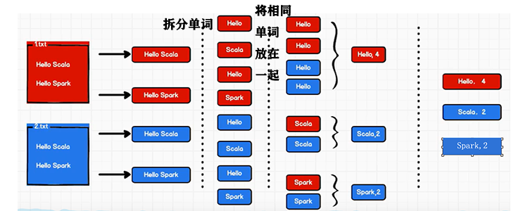

# Spark

主要用于数据计算，基于内存计算

#### spark内置模块


Spark Core 中提供了 Spark 最基础与最核心的功能，Spark 其他的功能都是在 Spark Core 的基础上进行扩展的。

Spark SQL 是 Spark 用来操作结构化数据的组件，可以使用 SQL或者 Apache Hive 版本的 SQL 方言（HQL）来查询数据。

Spark Streaming 是 Spark 平台上针对实时数据进行流式计算的组件，提供了丰富的处理数据流的 API。 

Spark MLlib 是 Spark 提供的一个机器学习算法库，提供了模型评估、数据导入和一些更底层的机器学习原语。

Spark GraphX 是 Spark 面向图计算提供的框架与算法库。

#### 搭建环境

1、创建一个Maven项目spark

（1）删除项目spark的src

（2）右键spark->New->Module  spark-core

2、下载scala

File->Settings->Plugins


添加sdk

File->Project Structure->Global Libraries


3、测试环境

spark-core->src->main->java


可以输出 Hello Spark证明搭建成功

# WorldCount例子

统计单词数量的思路图



#### 具体实现

步骤：建立和Spark框架的连接->执行业务操作->关闭连接

1、在spark-core的pom.xml中添加依赖

```
<dependencies>
    <dependency>
        <groupId>org.apache.spark</groupId>
        <artifactId>spark-core_2.12</artifactId>
        <version>3.0.0</version>
    </dependency>
</dependencies>
```

2、新建package data存储数据

1.txt 2.txt 

3、具体代码

```
package com.spark.core.wc
import org.apache.spark.rdd.RDD
import org.apache.spark.{SparkConf, SparkContext}
object Spark01_WordCount {
  def main(args: Array[String]): Unit = {
    //Application
    //Spark框架
    // TODO 建立和Spark框架的链接
    // setMaster：设置环境 local：本地环境
    val sparConf = new SparkConf().setMaster("local").setAppName("WordCount")
    val sc = new SparkContext(sparConf)
    // TODO 执行业务操作
    // 1.读取文件，获取一行一行的数据
    var lines: RDD[String] = sc.textFile("data/*")
    // 2.拆分为单词(扁平化操作)
    var words: RDD[String] = lines.flatMap(_.split(" "))
    // 3.将数据根据单词进行分组，便于统计
    // String:分组的key Iterable[String]:可迭代的集合
    var wordGroup: RDD[(String,Iterable[String])] = words.groupBy(word=>word)
    // 4.对分组后的数据进行转换
    var wordToCount = wordGroup.map{
      case (word,list) => {
        (word,list.size)
      }
    }
    // 5.打印转换结果
    var array:Array[(String,Int)] = wordToCount.collect()
    array.foreach(println)
    // TODO 关闭连接
    sc.stop()
  }
}
```

输出结果：


